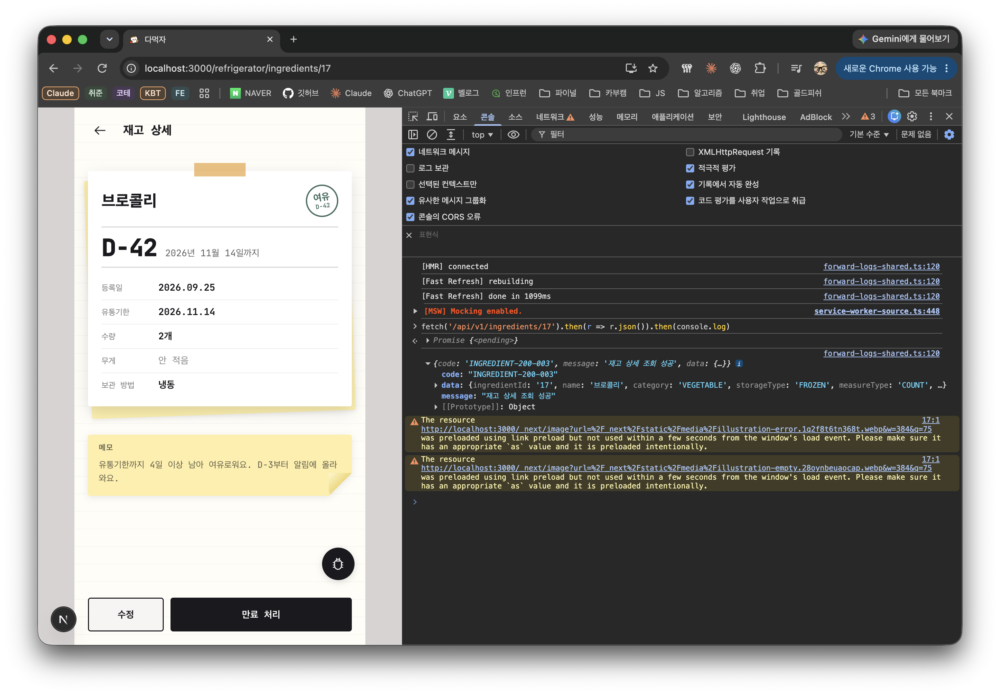
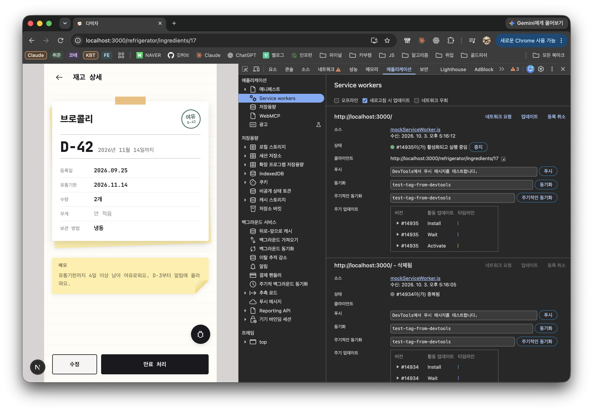

# MSW API 모킹

MSW는 브라우저의 API 요청을 가로챈다. `src/_app/mocks/handlers.ts`에 등록한 HTTP 메서드와 URL이 일치하면 Mock 응답을 반환하고, 등록하지 않은 요청은 실제 백엔드로 전달한다. 백엔드 API의 구현 여부를 자동으로 감지하지 않는다.

## 실행 환경

| 환경                    | MSW 동작                                                                                                                       |
| ----------------------- | ------------------------------------------------------------------------------------------------------------------------------ |
| 로컬 `pnpm dev`         | 꺼짐. `.env.local`에 `NEXT_PUBLIC_MSW=true`가 있으면 켜짐                                                                      |
| 로컬 `pnpm dev:msw`     | 켜짐. `?msw=off`로 접속하면 해당 브라우저에서 끄고 Serwist를 등록                                                              |
| 로컬 `pnpm build:start` | 켜지지 않음. 운영과 같은 Serwist 캐싱으로 동작하고, `/api/v1`은 `BACKEND_ORIGIN`(기본 `http://localhost:8080`)으로 전달        |
| `dev` 브랜치 배포       | 기본 꺼짐(Serwist 등록). `?msw=on`으로 접속하면 해당 브라우저에서 켜지고 `?msw=off`로 되돌림                                   |
| `main`/production 배포  | 켜지지 않음. `NEXT_PUBLIC_MSW=true`여도 production 환경에서는 시작하지 않고, Docker 이미지에서 `mockServiceWorker.js`도 제외됨 |

MSW와 Serwist는 둘 다 scope `/`의 서비스 워커라 한 브라우저에서 하나만 등록된다. `?msw=on|off` 선택은 브라우저에 저장된다.

`NEXT_PUBLIC_MSW`는 GitHub 변수로 등록할 필요가 없다. 배포 워크플로가 브랜치에 따라 빌드 값을 지정한다. 환경변수는 빌드 또는 개발 서버 시작 시 적용되므로 로컬에서 값을 바꾸면 개발 서버를 다시 시작한다.

## 사용 흐름

1. `src/_app/mocks/handlers.ts`에 실험할 API의 HTTP 메서드와 URL에 맞는 핸들러를 추가한다.
2. 화면에서 해당 URL을 호출하면, MSW가 켜진 환경에서는 Mock 응답이 실제 백엔드보다 우선한다. 브라우저에서 호출하지 않는 서버 측 요청은 이 워커가 가로채지 않는다.
3. 실제 백엔드 연동을 마치면 해당 핸들러를 삭제한다. 같은 URL의 요청이 다시 실제 백엔드로 전달된다. MSW 패키지는 유지해도 된다.

현재 예제는 `GET /api/v1/mock/health`다. MSW가 켜진 앱의 브라우저 콘솔에서 아래 명령을 실행하면 정상 동작 시 `MOCK-200-001` 응답이 나온다.

```js
fetch("/api/v1/mock/health")
  .then((response) => response.json())
  .then(console.log);
```

Chrome 개발자 도구의 **애플리케이션 → Service workers → 네트워크 우회**는 꺼둔다. 켜면 요청이 MSW를 건너뛴다. `GLOBAL-500-001`처럼 실제 백엔드 응답이 나오면 Mock 핸들러가 응답한 것이 아니다.

## 확인 화면

아래 화면은 MSW가 켜진 상태에서 핸들러가 없는 재고 상세 API가 실제 백엔드로 전달된 결과다.



서비스 워커가 활성화되어 있고 **네트워크 우회**가 꺼진 상태다.


